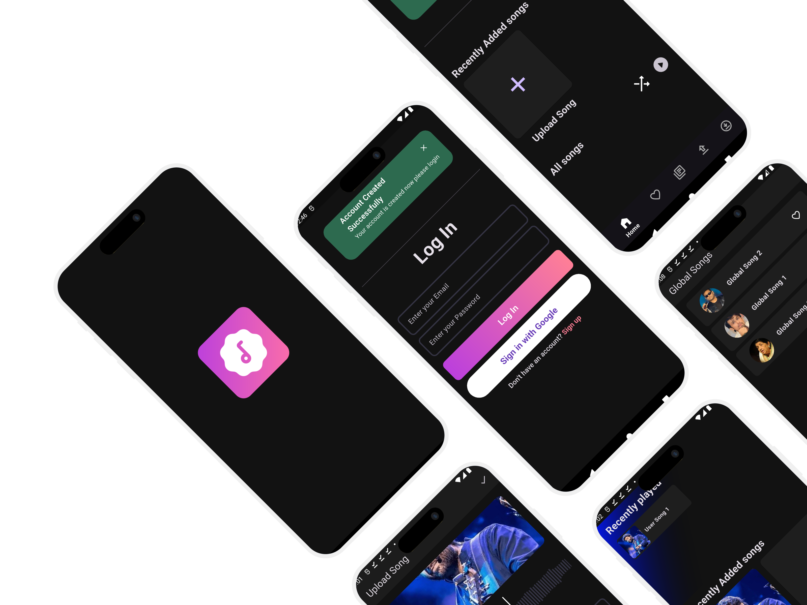
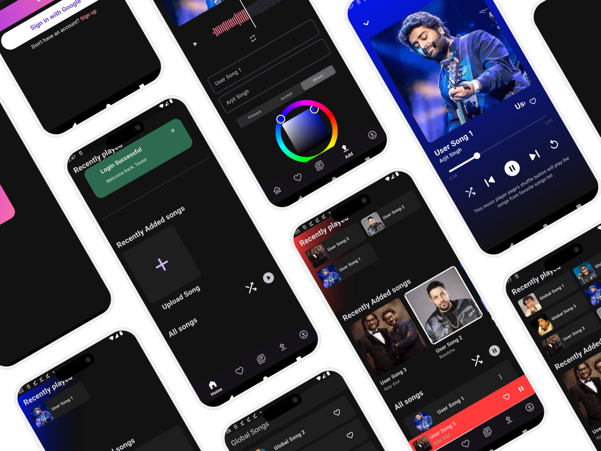
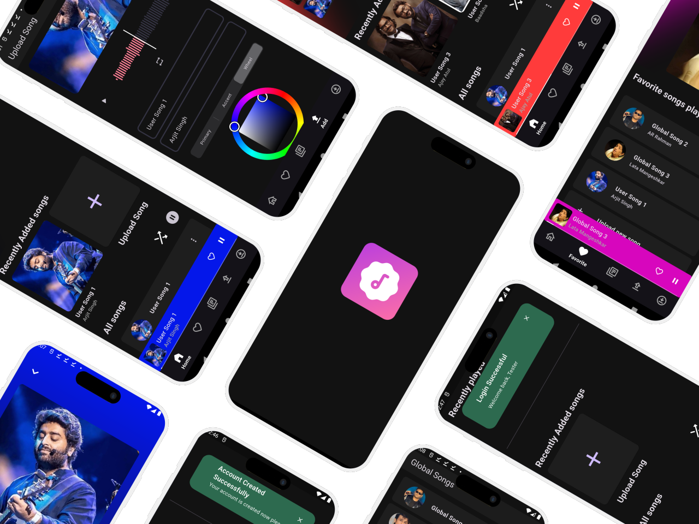

# 🎵 Muzzic – A Modern Music Platform  

Muzzic is a sleek, full-featured music platform that brings together users and creators in one seamless experience.  
It consists of two apps — a **User App** 🎧 for listeners and a **Admin App** 🎛️ for managing and publishing global songs.  

---

## 🌆 Preview  

Add your screenshots and demo video below 👇  

📸 **Screenshots:**  
  



🎬 **Demo Video:**  


---

## 🚀 Overview  

Muzzic allows users to upload their own songs, explore global tracks uploaded by the admin, and enjoy rich playback features.  
The platform provides a fast, modern, and intuitive experience for both music lovers and content managers.  

---

## ✨ Features  

### 🎧 User App  
- 🎵 **Upload Songs** – Share your own music instantly.  
- 🌍 **Global Songs** – Access tracks uploaded by the admin.  
- ❤️ **Favorites** – Add both user and global songs to your favorites page.  
- ⬇️ **Downloads** – Download songs as **audio** or **video** formats.  
- ⚡ **Smooth Playback** – Enjoy a responsive player and modern UI design.  

### 🧑‍💻 Admin App  
- 🎤 **Upload Global Songs** – Manage songs visible to all users.  
- 🗂️ **Content Management** – Organize, update, or remove global tracks.  
- 🔄 **Instant Sync** – Newly uploaded global songs appear automatically in the User App.  

---

## 🧩 Tech Stack  

| Layer | Technology |
|-------|-------------|
| **Frontend** | Flutter |
| **Backend** | FastAPI |
| **Database** | PostgreSQL |
| **Storage** | Cloudinary (for media files) |
| **Testing** | Thunder Client |
| **Version Control** | Git & GitHub |

---

## 🏗️ Project Structure  

```bash
muzzic/
│
├── user_app/ # Flutter app for users
├── admin_app/ # Flutter app for admin
├── backend/ # FastAPI server
│ ├── routers/
│ ├── models/
│ ├── database/
│ └── main.py
└── README.md
```

---

## ⚙️ Core Functionalities  

✅ Dual app system (User & Admin)  
✅ Media upload, streaming, and download management  
✅ Favorites system for personalized playlists  
✅ Secure REST API integration  
✅ Efficient database linking users, songs, and favorites  

---

## 🌱 Future Enhancements  

- 🧾 Playlist creation and sharing  
- 📊 In-app song analytics  
- 📶 Enhanced offline playback  
- 🎨 Better theme customization  

---

## 👨‍💻 Author  

Developed with ❤️ by **G Design**  
> A project built to explore and master Flutter + FastAPI integration for modern, full-stack music platforms.  

---

⭐ **If you like this project, don’t forget to give it a star!** ⭐  
